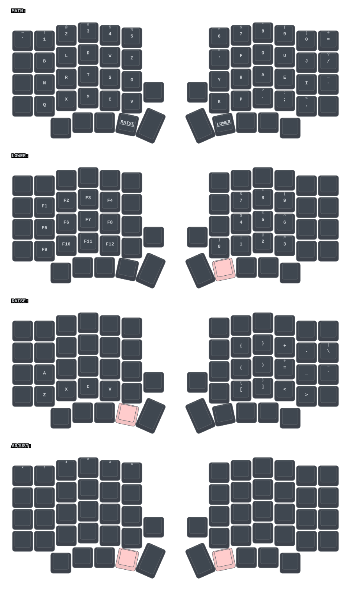

# ZMK Config — Sofle Choc Pro (60-key split)

Personal [ZMK](https://zmk.dev) firmware configuration for a split Sofle Choc Pro keyboard.

## Hardware

- **Keyboard:** [Sofle Choc Pro](https://www.keebart.com/de/produkte/sofle-kabellos) (4x6 + 5 thumb keys per half)
- **Firmware:** ZMK v0.3 via the vendor [Keebart/zmk-config](https://github.com/Keebart/zmk-config) board module
- **Build targets:** `sofle_choc_pro_left` and `sofle_choc_pro_right`
- **Encoders:** replaced with regular keys
- **Displays:** none

## Keymap Layout
Regenerated automatically by [Draw ZMK keymaps](.github/workflows/draw.yml) workflow whenever `config/*.keymap` changes.




## Building Firmware

Firmware builds automatically via GitHub Actions on every push touching `config/`, `zephyr/`, or `build.yaml`, using ZMK's reusable [Build ZMK firmware](.github/workflows/build.yml) workflow. 
Download the `.uf2` artifacts from latest [GitHub Actions Run](https://github.com/nsmolenskii/zmk-config/actions/workflows/build.yml) and copy them to each half's nice!nano while it's in UF2 bootloader mode.

## Repository Structure

```
.github/workflows/
  build.yml                # Builds firmware .uf2 artifacts
  draw.yml                 # Generate layers with keymap-drawer 
config/
  sofle_choc_pro.keymap    # Keymap source of truth
  sofle_choc_pro.conf      # Runtime Kconfig flags
  west.yml                 # ZMK and Keebart module pins
keymap-drawer/    
    sofle_choc_pro.svg     # Auto-generated keymap visualization
    sofle_choc_pro.yaml    # Auto-generated keymap configuration
zephyr/
  module.yml               # Marks this repo as a Zephyr/west module (board_root)
build.yaml                 # GitHub Actions build matrix
```
